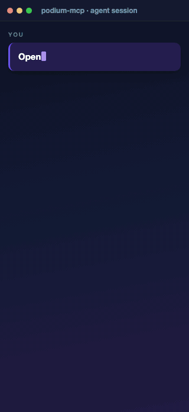

<div align="center">

# podium-mcp

**One baton. Every instrument.**

A single MCP stdio endpoint with **47 tools** for **iOS (simulator + real) and Android** device control, native UI automation, end-to-end flows, trustworthy assertions, React Native debugging, **WebView DOM + network inspection**, and **no-vision Unity/WebGL/GL game-engine automation** — one connection instead of half a dozen servers.

[](LICENSE)
[](package.json)
[](tsconfig.json)
[](https://modelcontextprotocol.io)
[](#the-47-tools)
[](#development--testing)
[](https://github.com/hoainho/podium-mcp/actions/workflows/ci.yml)
[](https://mcp.so/server/io.github.hoainho/podium-mcp)

<br/>



<sub><i>One prompt → podium drives Safari live → types the URL → explores the profile → opens a repo. Footage captured on a live iPhone 16 Pro simulator.</i></sub>

</div>

---

A podium is where a maestro stands — one place to conduct the whole orchestra. This MCP server unifies eight capability sets behind a single stdio endpoint:

- **Device & app management** — iOS simulators (`simctl`), real iPhones (`devicectl`), and Android (`adb`) behind one platform-tagged device model.
- **Native UI inspection & gestures** — route through `idb`/`mobilecli` with a Maestro fallback (no per-gesture JVM spin-up).
- **End-to-end flows & batch automation** — declarative Maestro flows, ordered action batches, and an engineer→QA flow exporter.
- **Trustworthy assertions** — an *oracle ladder* (WebView-DOM › native a11y › Maestro) that returns falsifiable, evidenced verdicts and **fails closed**.
- **WebView DOM + network** — resolve `WKWebView` DOM to tap coordinates, evaluate JS, drive navigation, and capture in-page HTTP traffic as JSON/HAR.
- **React Native debugging** — Metro console logs, network requests, and in-app state over CDP, plus host/simulator crash reports.
- **Real devices** — Android emulator/device via `adb` (gestures + `uiautomator` hierarchy); real iOS via `devicectl` lifecycle + an opt-in WebDriverAgent backend.
- **Game-engine automation, no vision** — drive Unity/WebGL/GL objects by name/path/component with engine-reported screen coordinates, via AltTester (native) or a WebGL-in-WebView CDP bridge.

Rather than wiring several MCP servers into every client config, `podium-mcp` exposes everything behind **one connection**, with a shared `execFile` layer (no shell), consistent structured errors, automatic retry around Maestro's iOS-driver flakiness, and a single health-check tool to confirm what's available on the host.

## What's new in v0.3.0

- **Android (emulator + real)** — an `adb` platform driver + gesture/inspect backend; `tap_on` / `swipe` / `input_text` / `inspect_screen` now work on Android, with the view hierarchy from `uiautomator dump`.
- **Real iOS device** — a `devicectl` lifecycle driver (the iOS-17+ RSD tunnel is auto-mounted by `devicectl`) and an opt-in **WebDriverAgent** backend (`PODIUM_WDA_URL`); missing signing / device / WDA prerequisites fail closed with guidance. Platform-aware capture (`screenshot` via `idb` → `idevicescreenshot`) is toolchain-gated — see [`docs/real-device-ios-runbook.md`](docs/real-device-ios-runbook.md).
- **No-vision game-engine automation** — `engine_inspect` / `engine_tap` / `engine_swipe` / `engine_call` address Unity/GL objects by name/path/component with screen coordinates (never screenshots), via an **AltTester** bridge or a **WebGL-in-WebView** CDP bridge. Requires an instrumented build; fails closed otherwise. (tool count 43 → **47**)
- **Multi-platform device model** — a `DeviceTarget { platform }` abstraction + `PlatformDriver` registry select the right backend per target; the iOS-sim path is unchanged.

> Real-device and engine paths land code-complete with unit/integration coverage; live e2e on a real emulator/device and an AltTester-instrumented Unity sample run on hardware (see `e2e/android-smoke.e2e.mjs`, `e2e/engine-smoke.e2e.mjs`, and the iOS runbook).

## What's new in v0.2.0

- **Oracle ladder + trustworthy verdicts** — `assert_visible` / `assert_text` / `assert_not_visible` / `wait_for_element` and `validate_flow` verify state through WebView-DOM › native a11y › Maestro, returning **evidenced** results that fail closed instead of guessing "looks ok".
- **Batch & export** — `run_steps` runs an ordered action batch in one call via the native backend; `export_flow` turns that batch into a reusable Maestro flow (the engineer→QA bridge).
- **WebView network capture** — `webview_network` records in-WebView `fetch`/`XHR` traffic and exports redacted **JSON or HAR 1.2** (the network path `metro_network` can't see for WebView-hosted apps).
- **Deeper RN introspection** — `metro_network` (CDP Network domain) and `metro_state` (read the in-app Redux store) join `metro_logs`.
- **Native-first gesture backend** — `idb`/`mobilecli` cut `tap_on` ~14.7 s → ~0.6 s and `inspect_screen` ~8.9 s → ~0.9 s, with a Maestro fallback that preserves app state.
- **Reliability hardening** — explicit per-command timeouts with a `timedOut` flag, timestamped recordings + a duration watchdog, native-backend re-probe TTL, exact bundle-id matching, and transparent iOS-simulator scope.
- **Registry-ready** — `server.json` manifest + OIDC publish to the official MCP Registry, test-gated before every publish.

## Table of contents

- [Why](#why)
- [Requirements](#requirements)
- [Install](#install)
- [Usage](#usage)
- [Quick start](#quick-start-order-of-use)
- [The 47 tools](#the-47-tools)
- [The oracle ladder — trustworthy assertions](#the-oracle-ladder--trustworthy-assertions)
- [Native-first gesture backend](#native-first-gesture-backend)
- [WebView & RN network introspection](#webview--rn-network-introspection)
- [Documented limits](#documented-limits-by-design-not-bugs)
- [Architecture](#architecture)
- [Development & testing](#development--testing)
- [Releasing](#releasing)
- [Prompt playbook & references](#prompt-playbook--references)
- [Design ideas](#design-ideas)
- [Contributing](#contributing) · [Security](#security) · [License](#license)

## Why

Driving a React Native app end-to-end usually means juggling several MCP servers —
one for device/app control, one for UI flows, one for Metro/debugger logs, another
for WebView inspection — each with its own config entry, quirks, and failure modes.
podium-mcp collapses that into **one** server with:

- a single `execFile`-based command runner (no shell — arguments are passed verbatim),
- consistent structured errors (a tool never crashes the server),
- automatic retry around Maestro's known iOS-driver flakiness,
- graceful degradation when a toolchain (e.g. `adb`) is absent,
- **evidenced verdicts** so an agent knows when a flow *actually* worked.

## Requirements

- **macOS** with Xcode command-line tools (`xcrun`, `simctl`)
- **Node.js ≥ 22** (uses native `fetch` and `WebSocket`; `.npmrc` sets `engine-strict=true`)
- **`mobilecli`** — bundled automatically as an npm dependency; the default native gesture + WebView backend (no separate install)
- *(optional)* **[`idb`](https://fbidb.io)** (`idb` + `idb_companion`) — preferred native gesture backend when both are present; auto-detected
- *(optional)* **[Maestro](https://maestro.mobile.dev)** on `PATH` (or at `~/.maestro/bin`) — the `run_flow` engine and the gesture fallback path
- *(optional)* a running **Metro** bundler for the `metro_*` debugging tools
- *(optional)* Android SDK + `adb` — adb paths are **detection-only** and degrade gracefully when absent

> **Platform scope (v0.3.0):** podium automates **iOS simulators**, **real iPhones** (`devicectl` lifecycle + opt-in WebDriverAgent), and **Android** emulators/devices (`adb` gestures + `uiautomator` hierarchy). `device_list` tags each target with its platform and the backend is selected per target. When a toolchain (e.g. `adb`) is absent, those paths degrade to an informative result instead of failing.

## Install

### Claude Code plugin (recommended)

No manual config — one-time marketplace setup, then install:

```
/plugin marketplace add github:hoainho/podium-mcp
/plugin install podium-mcp@podium
```

The plugin auto-starts the MCP server (all 47 tools) and ships four skills:

| Skill | Invoke | What it does |
|---|---|---|
| Device info | `/podium-mcp:device-info <UDID> [<BUNDLE_ID>]` | Health check, screen size, orientation, app list |
| E2E flow | `/podium-mcp:e2e <UDID> <BUNDLE_ID> [path or description]` | Run or author a Maestro flow |
| Bug repro | `/podium-mcp:bug-repro <UDID> <BUNDLE_ID> <description>` | Video + logs + crash evidence capture |
| RN debug | `/podium-mcp:rn-debug [UDID] [logs\|apps\|crash\|all]` | Metro logs, connected apps, crash reports |

### npx (zero install)

```json
{
  "mcpServers": {
    "podium": { "command": "npx", "args": ["-y", "podium-mcp"] }
  }
}
```

### Manual (from source)

```bash
git clone git@github.com:hoainho/podium-mcp.git
cd podium-mcp
npm install
npm run build
```

## Usage

Register the built server with any MCP client. **Claude Code** (`.mcp.json`):

```json
{
  "mcpServers": {
    "podium": {
      "type": "stdio",
      "command": "node",
      "args": ["/absolute/path/to/podium-mcp/dist/index.js"]
    }
  }
}
```

Quick manual smoke test over raw stdio (lists the 47 registered tools):

```bash
printf '%s\n' \
  '{"jsonrpc":"2.0","id":1,"method":"initialize","params":{"protocolVersion":"2024-11-05","capabilities":{},"clientInfo":{"name":"smoke","version":"0"}}}' \
  '{"jsonrpc":"2.0","method":"notifications/initialized"}' \
  '{"jsonrpc":"2.0","id":2,"method":"tools/list"}' | node dist/index.js
```

Always call **`podium_health`** first to confirm which toolchain is available on the host.

## Quick start (order of use)

1. **`podium_health`** — confirm `xcrun` / `maestro` / native backend availability.
2. **`device_list`** — pick a booted simulator `udid`.
3. **Read state** — `app_list`, `app_state`, `screen_size`, `orientation_get`.
4. **Drive the device** — `app_launch`, then `tap_on` / `input_text` / `swipe` / `press_key`, plus `set_location` and `orientation_set`. Batch several with `run_steps`.
5. **Author & verify** — `inspect_screen` to discover elements, `run_flow` for declarative checks, then `assert_visible` / `validate_flow` for an **evidenced** verdict.
6. **Inspect WebViews** — `webview_inspect` → tap coordinates, `webview_eval`, `webview_navigate`, `webview_network`.
7. **Capture & debug** — `screenshot` / `record_start`→`record_stop`; `metro_logs` / `metro_network` / `metro_state`; `crash_list` / `crash_get`.

## The 47 tools

> Every tool returns structured JSON and never throws — failures come back as MCP tool errors. See [`docs/tool-catalog.md`](docs/tool-catalog.md) for the authoritative per-parameter reference.
>
> **Platform support (v0.3.0):** the gesture / inspect / lifecycle tools below run on **iOS simulators**, **real iPhones** (`devicectl` + opt-in WebDriverAgent via `PODIUM_WDA_URL`), and **Android** (emulator/device via `adb`; hierarchy from `uiautomator`). `device_list` tags each device with its platform and the backend is selected per target.

### Game engine — Unity / WebGL / GL, no vision (4)

| Tool | Key params | Backing engine | Behavior |
|---|---|---|---|
| `engine_inspect` | udid, by?, value | AltTester (TCP) / WebGL CDP bridge | Lists engine objects (by name/path/component/text) with absolute screen coords — **no screenshots** |
| `engine_tap` | udid, by?, value | AltTester / CDP | Resolves the object and taps its screen coordinates |
| `engine_swipe` | udid, fromX/Y, toX/Y, durationMs? | AltTester / CDP | Swipe inside the engine view |
| `engine_call` | udid, by?, value, component, method, parameters? | AltTester / CDP | Invokes a C# component method by reflection (the engine analog of a DOM event handler) |

> Engine tools require an **AltTester-instrumented build** (dev/staging) reachable on the forwarded port, or a `window.__podiumEngine` bridge for WebGL-in-WebView. On a non-instrumented build they **fail closed** with an actionable error — never a vision fallback.

### Health & toolchain (1)

| Tool | Key params | Backing engine | Behavior |
|---|---|---|---|
| `podium_health` | — | `which` probes | Never fails; reports `toolchain { xcrun, maestro, adb }`, native backend, and `platforms: [ios-sim, ios-real, android]` |

### Device & simulator (6)

| Tool | Key params | Backing engine | Behavior |
|---|---|---|---|
| `device_list` | — | `simctl list -j` + `adb devices` | Merged iOS inventory; adb absent → `android: { available: false }` (detection-only) |
| `device_boot` | udid | `simctl boot` | Idempotent — already-booted → `alreadyBooted: true`; waits up to 30 s |
| `screen_size` | udid | `simctl io screenshot` + `sips` | `{ widthPx, heightPx }` (real pixels) |
| `orientation_get` | udid | native query → screenshot heuristic | `{ orientation, basis }` (exact when native) |
| `set_location` | udid, latitude, longitude | `simctl location set` | Codifies the QA geo-spinner fix |
| `open_url` | udid, url | `simctl openurl` | Deep links + `https://` |

### Apps (6)

| Tool | Key params | Backing engine | Behavior |
|---|---|---|---|
| `app_install` | udid, path (.app/.zip) | `simctl install` | Structured tool error |
| `app_launch` | udid, bundleId | `simctl launch` | Explicit 30 s timeout (cold RN launches no longer mis-report failure) |
| `app_terminate` | udid, bundleId | `simctl terminate` | Structured tool error |
| `app_uninstall` | udid, bundleId | `simctl uninstall` | Structured tool error |
| `app_list` | udid | `simctl listapps` + `plutil` | `{ count, apps: [{ bundleId, name, type }] }` |
| `app_state` | udid, bundleId | `simctl listapps` + `launchctl` | `{ installed, running }` — **exact** bundle-id match |

### Capture (3)

| Tool | Key params | Backing engine | Behavior |
|---|---|---|---|
| `screenshot` | udid, saveTo? | `simctl io screenshot` | Returns `path` + `byteSize` (no base64 bloat) |
| `record_start` | udid, saveTo? (.mp4) | detached `simctl io recordVideo` | `{ ok, path, pid }`; timestamped path + duration watchdog (`PODIUM_MAX_RECORDING_MS`); one per udid |
| `record_stop` | udid | SIGINT recorder + flush | `{ ok, path, sizeBytes }` |

### UI inspection & gestures (8)

| Tool | Key params | Backing engine | Behavior |
|---|---|---|---|
| `inspect_screen` | udid, compact? | native flat AX list → `maestro hierarchy` | `compact:true` (default) returns only meaningful nodes |
| `tap_on` | udid, bundleId, text\|id\|x+y, double?, long? | native tap → Maestro fallback | text/id resolved via the element list; reports `backend` |
| `input_text` | udid, bundleId, text, submit? | native → Maestro fallback | reports `backend` |
| `swipe` | udid, bundleId, direction, start/end? | native → Maestro fallback | %/pixel overrides resolved vs logical screen size |
| `press_key` | udid, bundleId, key | native → Maestro fallback | back/power/tab are Android-only |
| `orientation_set` | udid, bundleId, value | native → Maestro fallback | PORTRAIT / LANDSCAPE_LEFT / LANDSCAPE_RIGHT / UPSIDE_DOWN |
| `tap_with_fallback` | udid, x, y, maxRetries?, offsetStep? | native tap + before/after oracle | For WebGL/Canvas overlays; **no blind walk** (`offsetStep` opt-in) |
| `notification_bar_clear` | udid, bundleId? | native tap + oracle | Dismisses the RN debug notification bar |

### Flows & batch automation (4)

| Tool | Key params | Backing engine | Behavior |
|---|---|---|---|
| `run_steps` | udid, bundleId, steps[] | native backend (idb/mobilecli) | Ordered action batch in **one call**; per-step results |
| `run_flow` | udid + exactly one of yaml/files/dir(+tags), env? | `maestro test` | Exactly-one-of validated before exec; per-step pass/fail |
| `export_flow` | steps[], output path | flow generator | Exports a `run_steps` batch to a reusable Maestro flow (engineer→QA bridge) |
| `cheat_sheet` | — | bundled `assets/maestro-cheat-sheet.yaml` | Fully offline Maestro syntax reference |

### Assertions & verdicts — the oracle ladder (5)

| Tool | Key params | Backing engine | Behavior |
|---|---|---|---|
| `assert_visible` | udid, text\|id, … | oracle ladder (WebView-DOM › a11y › Maestro) | Evidenced pass/fail; reports which oracle proved it |
| `assert_text` | udid, text | oracle ladder | by-text shorthand for `assert_visible` |
| `assert_not_visible` | udid, text\|id | oracle ladder | **Fails closed** — if absence can't be verified, it fails |
| `wait_for_element` | udid, text\|id, timeoutMs? | oracle ladder (polling) | Polls until visible or times out |
| `validate_flow` | udid, flow + assertions | oracle ladder + flow run | Trustworthy, falsifiable verdict on whether a just-built flow works |

### WebView DOM & network (4)

| Tool | Key params | Backing engine | Behavior |
|---|---|---|---|
| `webview_inspect` | udid, selector?, webviewId?, max? | `mobilecli` (CDP) | Resolves a CSS selector to DOM elements with absolute `tapX`/`tapY` |
| `webview_eval` | udid, expression, webviewId? | `mobilecli` (CDP) | Runs JS in the page context; gated by `PODIUM_DISABLE_WEBVIEW_EVAL=1` |
| `webview_navigate` | udid, action (goto/back/forward/reload), url? | `mobilecli` (CDP) | Drives WebView navigation |
| `webview_network` | udid, durationMs?, format (json/har)?, saveTo?, redact?, includeResources? | CDP + in-page fetch/XHR shim + Resource Timing | Captures in-WebView HTTP traffic; exports **redacted JSON or HAR 1.2** |

### React Native debugging — Metro CDP (4)

| Tool | Key params | Backing engine | Behavior |
|---|---|---|---|
| `metro_apps` | port? (8081) | GET `http://localhost:<port>/json` | Differentiated errors (timeout vs not-running vs other) |
| `metro_logs` | wsUrl?/port?, durationMs?, maxLogs? | WebSocket + CDP `Runtime.enable` | Auto-discovers first app when URL omitted |
| `metro_network` | wsUrl?/port?, durationMs?, maxEntries? | CDP `Network.enable` | Requests (url/method/status/mimeType/ts) |
| `metro_state` | expression?/wsUrl?/port?, timeoutMs? | CDP `Runtime.evaluate` | Reads in-app state (default: globally-exposed Redux store) |

### Crash diagnostics (2)

| Tool | Key params | Backing engine | Behavior |
|---|---|---|---|
| `crash_list` | processName?, sinceHours?, udid? | host + sim `DiagnosticReports` | Newest-first; tagged `source: host \| simulator` |
| `crash_get` | id, udid? | same | Path-traversal-safe (basename only); truncates honestly |

## The oracle ladder — trustworthy assertions

"It works" is operationalized as a **falsifiable, evidenced verdict** — never "looks ok". Assertions and `validate_flow` resolve visibility through a three-rung ladder, using the strongest available signal:

1. **WebView DOM** — when an inspectable `WKWebView` is present, query the real DOM.
2. **Native accessibility** — the native AX element set (via `idb`/`mobilecli`).
3. **Maestro** — `assertVisible`/`assertNotVisible` as the fallback.

`assert_not_visible` **fails closed**: if absence can't be positively verified (e.g. a WebView is unreadable), it reports failure rather than a false pass. Every verdict names the oracle that produced it, so an agent can weight its confidence.

## Native-first gesture backend

Imperative gestures (`tap_on`, `input_text`, `swipe`, `press_key`, `orientation_set`, `run_steps`) and `inspect_screen` route through the fastest available backend, probed once and cached (with a short **negative-cache TTL** so a backend that starts after launch is picked up):

1. **`idb`** — when both `idb` and `idb_companion` are installed (native, fastest).
2. **`mobilecli`** — the bundled npm dependency (prebuilt Go binary). Default; no install.
3. **Maestro fallback** — when no native backend resolves, or for actions it can't express (double/long-press, `UPSIDE_DOWN`). The gesture generates a minimal flow with `launchApp: { stopApp: false }`, foregrounding the app **without restarting** so state is preserved.

Each result reports the `backend` it used. Set `PODIUM_DISABLE_NATIVE=1` to force Maestro. Eliminating the per-gesture JVM spin-up cut `tap_on` ~14.7 s → ~0.6 s and `inspect_screen` ~8.9 s → ~0.9 s on an iPhone 16 Pro simulator. Run `npm run benchmark` for a full pass/fail sweep.

**Maestro flakiness retry:** when the fallback runs, its iOS driver intermittently fails with `Failed to connect to 127.0.0.1:<port>`. Flows retry up to **2× with 2 s / 5 s backoff** and report the `retries` count; a persistent failure returns the raw output with remediation hints.

## WebView & RN network introspection

Two distinct network layers, two tools:

- **`metro_network`** captures requests on the **RN/Hermes** target via the CDP Network domain — the right tool for a native RN app's own `fetch`.
- **`webview_network`** captures traffic **inside a `WKWebView`**: it injects a `fetch`/`XHR` recorder (rich — method/status/headers/body for calls *after* capture starts) **and** reads the browser's Performance Resource Timing buffer (`includeResources`, default on) — every request since navigation, including pre-capture ones (URL/timing/size). The merge yields a near-complete request list, exported as redacted **JSON or HAR 1.2**.

For an RN shell that hosts its UI in a WebView, the app's API calls run in the web layer — so `metro_network` sees nothing and `webview_network` is the tool to reach for. WebView tools require `WKWebView.isInspectable = true` (default in debug/staging builds; off in production); when none is found they return an **actionable** error.

## Documented limits (by design, not bugs)

- **WebGL/Canvas content is un-automatable by selector** — no DOM/hierarchy; use `tap_with_fallback` with screenshot-derived coordinates.
- **WebView tools are dev/QA only** — production App Store builds typically set `isInspectable = false`; tools return an actionable error and fall back to coordinate taps.
- **WebView content-process memory is unreadable** from the app sandbox (platform limit) — use indirect signals (memory warnings, process terminations).
- **Maestro `text:` matcher is full-string regex (IGNORE_CASE)** — partial strings don't match; copy hierarchy `text` verbatim or anchor with `.*`.
- **Android requires `adb` on `PATH`** — gestures / inspect / screenshot work once `adb` is present; when it's absent every Android path degrades to a structured "adb not found" result.
- **`orientation_get` is a screenshot-aspect heuristic** when no native backend is present — iOS simulators expose no direct orientation query.
- **`record_start`/`record_stop` keep state in-process** — serialize `start` → … → `stop` on one connection; one active recording per udid (a watchdog finalizes one that's never stopped).

## Architecture

```
src/
  index.ts          # MCP server entry — registers every tool group, warms caches
  lib/
    exec.ts         # execFile-based runner (NO shell) + timeout/timedOut flag
    result.ts       # shared ok/error MCP content helpers
    simctl.ts       # xcrun simctl wrappers + device-list TTL cache
    native.ts       # gesture/inspect backend: idb → mobilecli → null (re-probe TTL)
    idb.ts          # idb gesture/inspect adapter
    gesture.ts      # unified native→Maestro executors (shared by screen + steps)
    oracle.ts       # the oracle ladder: WebView-DOM › a11y › Maestro
    maestro.ts      # Maestro engine: flow runner, idb retry, hierarchy
    export-maestro.ts # run_steps → reusable Maestro flow
    har.ts          # HAR 1.2 export for webview_network
    webview.ts      # mobilecli CDP — WebView list/inspect/eval/navigate/network
    metro.ts        # Metro CDP — app discovery, logs, network, state
    crash.ts        # DiagnosticReports crash listing/reading
    recording.ts    # detached screen recording lifecycle + watchdog (platform-aware)
    device-target.ts # DeviceTarget model + PlatformDriver registry (v0.3.0)
    drivers/        # per-platform lifecycle: ios-sim, android, ios-real
    adb.ts          # Android adb driver (list/install/launch/screenshot/wm size)
    adb-backend.ts  # adb gesture/inspect (input + uiautomator → AX elements)
    iosreal.ts      # real iOS via devicectl (list/install/launch) + capture
    wda.ts          # opt-in WebDriverAgent backend (/source + tap/swipe/keys)
    engine.ts       # no-vision engine client (AltTester + WebGL-in-WebView)
    engine-transport.ts # WebSocket transport for the AltTester bridge
  tools/            # one file per group:
                    #   health, device, screen, steps, flow, assert,
                    #   validate, webview, debug, engine
assets/             # bundled offline Maestro cheat sheet + demo.gif
scripts/            # benchmark.ts, compare-mcps.ts
e2e/                # smoke suites (smoke / full-smoke / webview-network-live / android-smoke / engine-smoke)
docs/               # tool catalog, e2e transcript, roadmap
```

## Development & testing

```bash
npm run build       # tsc
npm run typecheck   # tsc --noEmit
npm test            # vitest run — 269 unit/integration tests (exec/network mocked, no sim needed)
npm run benchmark   # spawn a fresh server over stdio and sweep the tool suite
node e2e/smoke.e2e.mjs        # real E2E against a booted simulator (macOS + Xcode)
node e2e/full-smoke.e2e.mjs   # drives the iOS-sim tool handlers (happy + structured-error paths)
node e2e/android-smoke.e2e.mjs # Android emulator/device smoke (story A3)
node e2e/engine-smoke.e2e.mjs  # AltTester engine smoke; skips without an instrumented build (story C4)
```

**269 tests across 24 files, all passing** — including the v0.3.0 device-target registry, the Android `adb` driver + `uiautomator` parser, the AltTester engine client + WebGL bridge, the `devicectl`/WDA real-iOS parsers, plus the v0.2.0 oracle ladder, recording watchdog, gesture-parity, HAR export, WebView, and Metro paths.

Standards: TypeScript strict, **no `as any` / `@ts-ignore`**, **no shell execution** (all commands via `lib/exec.ts`), tools return structured errors instead of throwing. See [CONTRIBUTING.md](CONTRIBUTING.md) for the "add a new tool" checklist.

**E2E on CI:** the [`E2E (simulator)`](.github/workflows/e2e-sim.yml) workflow boots a real iOS simulator on a macOS runner and runs the smoke suites nightly + on demand (not a PR gate — simulator runs are slow). `full-smoke.e2e.mjs` asserts the happy path where a target exists and the **real structured-error path** where a dependency is absent (a debug `isInspectable` app for WebView; a connected RN app for `metro_*`).

## Releasing

`server.json` is the official MCP Registry manifest. Pushing a `v*` tag runs
[`Publish to npm`](.github/workflows/publish-npm.yml) then
[`Publish to MCP Registry`](.github/workflows/publish-mcp-registry.yml) (GitHub OIDC for the
`io.github.hoainho/*` namespace — no long-lived token). Both workflows run `typecheck → build → test`
as a gate first; the registry publish only succeeds once the matching npm version is live, and
versions are immutable.

## Prompt playbook & references

- **[`prompts/`](prompts/)** — copy-paste prompts for e2e flows, test cases, feature verification, bug fixing, and device control. Each names the podium tools it drives and was validated on a real simulator. Start with [`prompts/README.md`](prompts/README.md).
- **[`docs/tool-catalog.md`](docs/tool-catalog.md)** — authoritative tool-by-tool reference.
- **[`docs/e2e-demo.md`](docs/e2e-demo.md)** — a real transcript against a booted iPhone 16 Pro simulator running a production RN app.

## Design ideas

- **One podium, one connection.** A single server fronts every mobile capability so an agent configures one endpoint and discovers all 47 tools at once.
- **Safe by construction.** Every external command runs through an `execFile` layer with an explicit argument array — never a shell string.
- **Never crash the conductor.** Tools return structured results and errors instead of throwing; one bad call can't take the server down.
- **Degrade, don't fail.** A missing toolchain (e.g. Android's `adb`) yields an informative result rather than a hard error.
- **Prove it, don't guess.** Assertions return evidenced verdicts via the oracle ladder and fail closed when they can't verify.

## Contributing

Contributions welcome — see [CONTRIBUTING.md](CONTRIBUTING.md) and the
[Code of Conduct](CODE_OF_CONDUCT.md). Use the issue templates for bugs and feature requests.

## Security

Please report vulnerabilities privately per [SECURITY.md](SECURITY.md) — do not open a public issue.
SECURITY.md also documents the `webview_eval` / `run_flow` trust boundary and the PII-in-transcript caveat.

## License

[MIT](LICENSE) © 2026 hoainho
